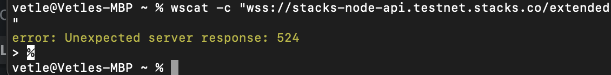
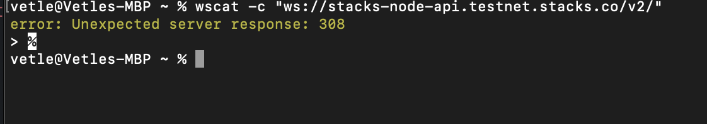

# See the project LIVE! https://zest-protocol-solution-lqzeymu6a-xzirez.vercel.app/

# Some improvements, issues and comments

👋 

Couple quick comments. This app is obviously not a production ready master piece. I spent a couple hours more then needed, but not enough for production. I have neglected to use react-form, form validators, lots of async error handling and well i test like nothing. For example i use vanilla html form. Why you might ask? I have no used a vanilla html form in years and it was super fun. I even wanted to use document selectors...

There is one big issue with the hydration, which i summarize below. Basically you get an error when refreshing the page. It could be i solved this in the final version if not - please don't refresh the page :(

I also could not get the ws to work. So many issues and lack of documentation. I figured out some stuff which is explained, below.

## Some issues i faced: 
 ✍️

 - I managed to test the subscription by using the wallet transfer. However, i am not able to connect to the endpoints provided in the docs. Only the mainnet sub works for me. The rest are giving me errors. I even tried a linux command, which gives me 308. Maybe docs are outdated? 

Looks like it works with if i enable TSL meaning wss in url. Image below showing connection time out when using a wss url. Polygon actually has a similar issue. Auto upgrades to SSL. Still does not work in the app tho.

  

 - So there is one big issue with using the useAccount hook. The account only updates for mainnet account address. This took me maybe an hour to realize when tweaking the subscription. I made a solution to either use hardcoded account or to have the user input their own account. I opened an issue here: https://github.com/fungible-systems/micro-stacks/issues/162

- BIGGEST issue, there is somethign with the hydration and Next.JS. So Emil kinda told me to just delete a bunch of the code in the beginning, which broke some of the server side hydration stuff. I have looked at fixing this, but the easiest is prblly to skip the server side stuff for now. Why we have Next.js if we skip it however is well ehm well not optimal.
 
 - When testing i stumbled upon what seems to be a next.js related error with jest. It can be summarized in the first answer here. Would have been easier to test: https://stackoverflow.com/questions/72368786/next-js-typeerror-cannot-read-properties-of-null-reading-usememo

## Improvements

- [ ] TEST TEST TEST. Jest, Mocha, Chai, Tea whatever. Test it.
- [ ] Subscription worked, but really hard to test. Should be revisited
- [ ] Fix hydration issues. Possibly ask author of micro stasks.
- [ ] Build out UI

## Closing thoughts

🔧 All in all, it's super cool to see that a BTC L1 can do lots of this DEFI stuff. From looking over the source code of the libraries i can say they are well organized compared to some of the EVM libraries i used in the past. Im generally pretty opimistic towards the quality aspect, we just have to you know BUILD out the ecosystem 🛠

